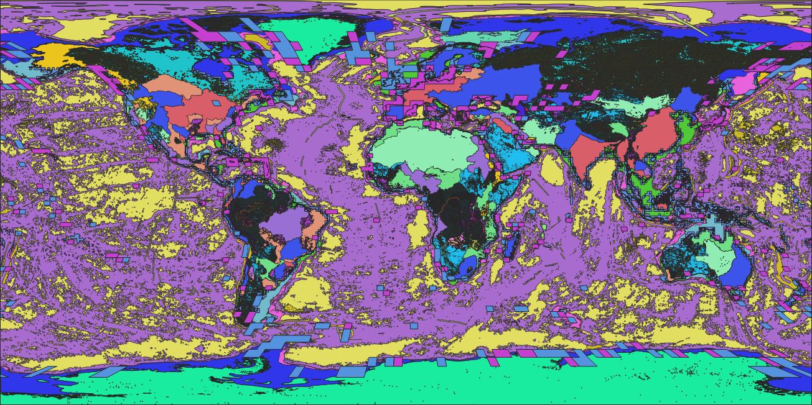
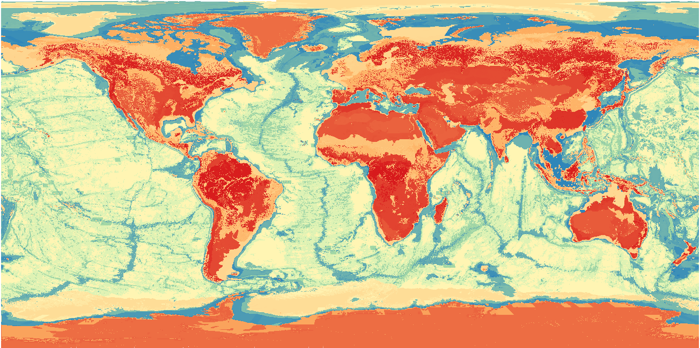
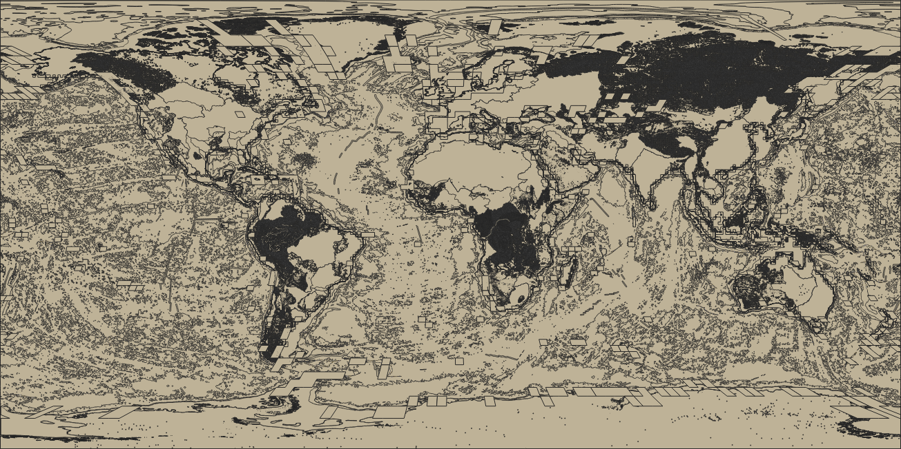

IUCN Global Ecosystem Typology 

Andrea Mandrici, Giacomo Delli 20240418

Downloaded from:
+  https://global-ecosystems.org/ (website)
+  https://www.nature.com/articles/s41586-022-05318-4 (paper)
+  https://doi.org/10.5281/zenodo.3546513 (all datasets)

Several downloads (20231005, 20231021, 20231023, 20240415, 20240412) and contacts with the author (David Keith <david.keith@unsw.edu.au>) were required.

Within the various releases:
+  All the objects have been renamed
+  M1.10.WM.nwx_v1.0.json has been added
+  MT2.2.IM.orig_v1.0.json has been added
+  T1.3.WM.nwx_v1.0.json has been updated (old name was: T1_3_Trop_montane_rainforests.json)
+  T7.1.web.alt_v2.0.json has been updated (old name was: T7_1_Croplands.json), but the new version was truncated; consequently:
+  T7.1.web.alt_v2.0.json.bz2 has been obtained by the author
+  S1_2_Endolithic_systems.json exists only in one of the old release.

Vectors (geojson format...) have been imported in PostGIS with the script [import.sh](./import.sh).

PostGIS geometries have been pre-processed with the script [iucn_get.sql](./iucn_get.sql).

The original categories have been organized into 220 codes representing:
* 10 realms (4 main, 6 transitional)
* 25 biomes
* 110 functional groups (major or minor occurrence)
of which 171 are currently present [class_code_objects.csv](./class_code_objects.csv). 

Flat version has been obtained (10 hours processing with 140 threads dedicated) with the [DOPA flattening sequence](../../flattening/README.md), with configuration as by [workflow_parameters.conf](./workflow_parameters.conf).
The result is a PostGIS table exported as raster, where the atomic object/pixel (cid) is a unique combination (1897634 cid in total) of **ecosystem functional groups (EFG)** overlapping each other.
There are 10505 cid made exclusively by combinations of major EFJ, and 1887129 made by combinations of major and minor EFG.
There is a maximum of 40 (21 major+19 minor) EFG overlapping (major max 22, min 1; minor max 25, min 0).

